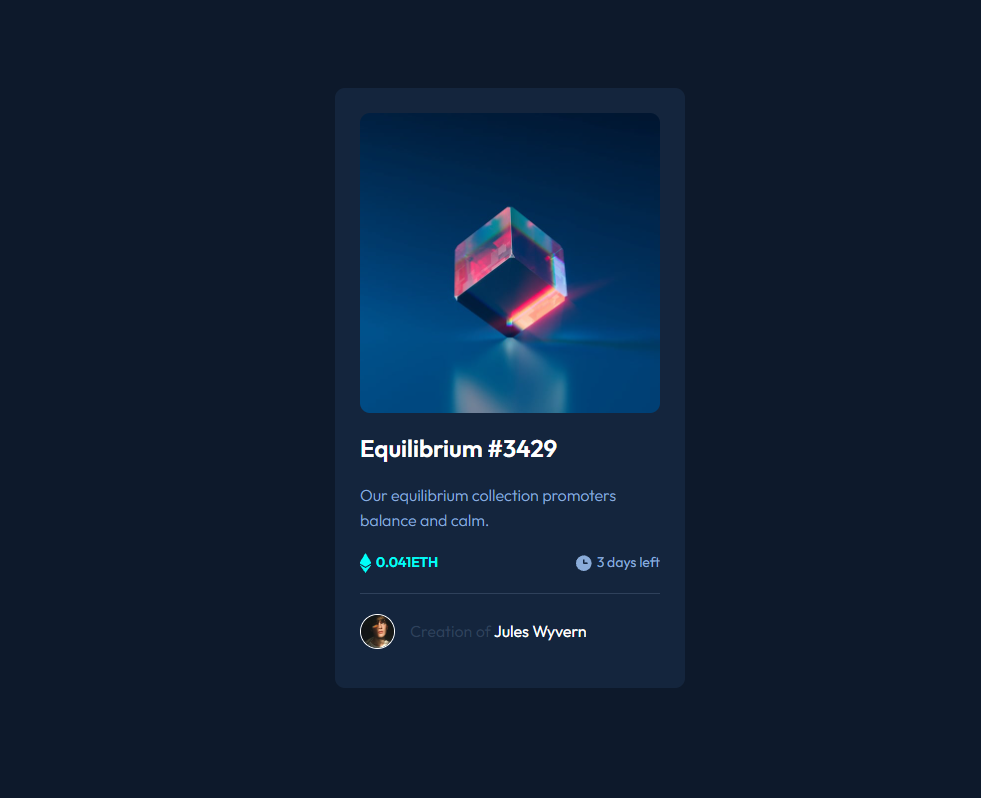

# Frontend Mentor - solução de componente de cartão de visualização NFT

Esta é uma solução para o [desafio do componente de cartão de visualização NFT no Frontend Mentor](https://www.frontendmentor.io/challenges/nft-preview-card-component-SbdUL_w0U). Os desafios do Frontend Mentor ajudam você a melhorar suas habilidades de codificação através da construção de projetos realistas.

## Índice

- [Visão geral](#visão geral)
  - [O desafio](#o-desafio)
  - [Captura de tela](#captura de tela)
  - [Links](#links)
- [Meu processo](#meu-processo)
  - [Construído com](#construído com)
  - [O que aprendi](#o que aprendi)
  - [Desenvolvimento contínuo](#desenvolvimento contínuo)
  - [Recursos úteis](#useful-resources)
- [Autor](#autor)
- [Agradecimentos](#agradecimentos)

**Observação: exclua esta nota e atualize o índice com base nas seções que você mantém.**

## Visão geral

### O desafio

Os usuários devem ser capazes de:

- Veja o layout ideal dependendo do tamanho da tela do dispositivo
- Veja os estados de foco para elementos interativos

### Captura de tela

